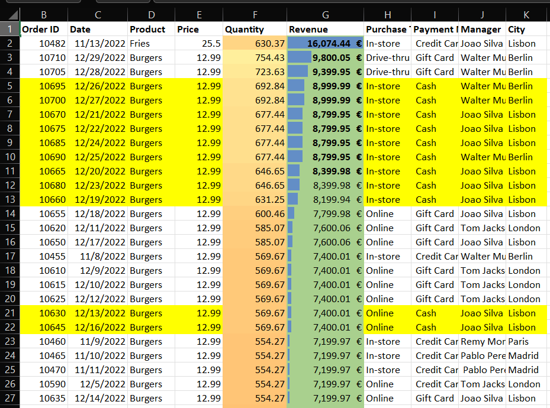
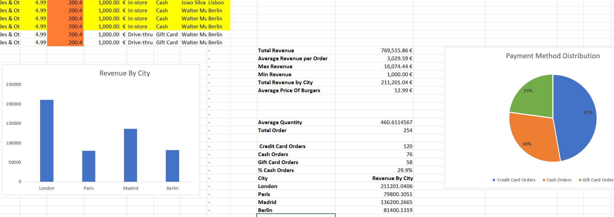
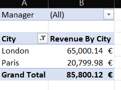
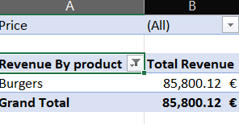
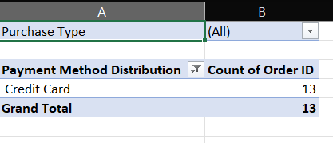
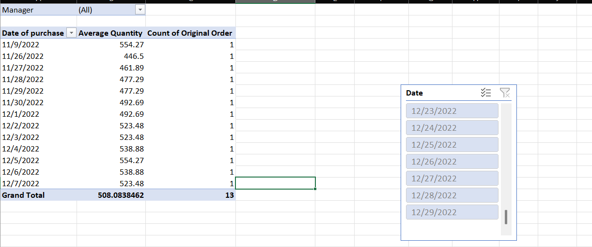
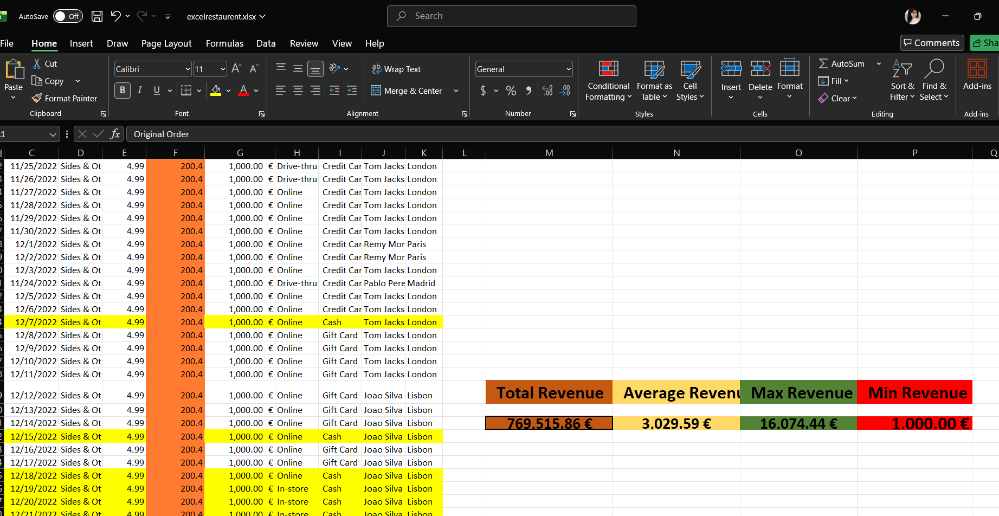
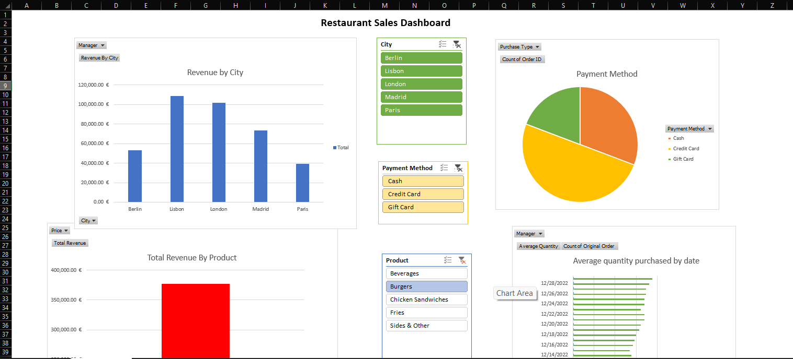

​🍴 International Restaurant Sales & Operational Analytics
​Project Category: Business Intelligence & Advanced Data Engineering
Tech Stack: Microsoft Excel (Advanced Formulas, Data Modeling, KPI Dashboards)
​📊 Project Overview
​This project involves a strategic audit of an international restaurant chain operating across five major European hubs: London, Paris, Lisbon, Berlin, and Madrid. The objective was to transform over 250 raw transaction logs into an interactive analytical tool to track revenue performance, manager effectiveness, and customer behavior. By moving beyond basic static reporting, I developed a logic-driven engine that provides real-time insights into a total revenue stream of over $376,000.

Master Dataset:

Master Dataset:

​🧮 Advanced Excel Technical Stack
​To ensure data integrity and granular reporting, I utilized complex Excel functions to automate the calculation of key performance indicators (KPIs) directly from the master sales data:
​Logic-Driven Revenue Tracking (SUMIFS): 

Formula Logic (SUMIFS/AVERAGEIFS):

​Developed custom tables to calculate total revenue segmented by both city and specific product categories (e.g., Burgers vs. Fries).
​Formula Example: =SUMIFS(Revenue_Range, City_Range, "Lisbon", Product_Range, "Burgers")
​Operational Efficiency Metrics (AVERAGEIFS): 
​Determined the average order quantity per manager and per payment method to identify which regional leaders were driving higher volume.
​Transaction Volume Analysis (COUNTIFS): 
​Measured the frequency of different "Purchase Types" (e.g., In-store vs. Drive-thru) to assist in operational staffing and logistics planning.
​Payment Ecosystem Distribution: 
​Analyzed the breakdown of payment methods (Cash, Credit Card, and Gift Card) to identify customer preferences, revealing that Credit Cards are the primary revenue driver.

### 📈 Phase 2: Deep-Dive Analysis
Segmenting the data to find growth opportunities in specific cities and products.

Revenue by City & Product:

Customer Behavior (Payments & Timing):

​🎨 Dashboard Visualization & KPI Logic
​I implemented a high-impact visual layer using Conditional Formatting and Data Modeling to translate raw numbers into actionable business intelligence:
​Performance Heatmaps (Color-Coded KPIs): 
​🟢 Green (High Performance): Markets like Lisbon and London that exceeded $100k in total sales.
​🟡 Yellow (Steady/Stable): Locations and managers maintaining consistent order volumes and mid-range revenue.

### 🖥️ Phase 3: Executive Dashboards
Final visualization layer with color-coded KPIs for management review.

Operational Health (Traffic Light KPIs):

Final Interactive Dashboards:

.png)

​🔴 Red (Underperforming): Specific shifts or products where the average order value fell below target thresholds, signaling a need for intervention.
​Dynamic Slicers: Integrated filters to allow stakeholders to view performance metrics by specific Managers (e.g., Joao Silva, Walter Muller) or by individual cities.
​📈 Key Business Insights
​Market Leadership: Lisbon emerged as the top-performing market with $108,799 in revenue, followed closely by London at $101,800.
​Product Performance: Burgers represent the core revenue driver for the organization across all international locations.
​Managerial Impact: Correlated regional success with specific leadership, identifying peak performance periods for managers in high-volume cities like Berlin.
​📂 Repository Structure
​excelrestaurent.xlsx: The complete analytical workbook featuring: 
​Sales-Data-Analysis: Master dataset with 250+ cleaned transaction records.
​Formula-Based Reports: Custom-built tables utilizing SUMIFS and AVERAGEIFS for deep-dive analysis.
​Operational Sheets: Specialized tabs for Payment Method distribution and City-wise revenue breakdowns.
